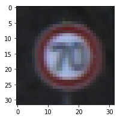

# Self-Driving Car Engineer Nanodegree

## Project : **Traffic Sign Classifier Using Deep Learning**
---
 

 

### Prediction : 30 km/h
---

## Overview

### 1. Objective
  - Build a program that classify German Traffic Sign using deep learning.

### 2. Applied Techniques
* Tensorflow for building neural network
* Covolutional Neural Network(CNN) to implement classifier

### 3. The goals / steps of this project
* Load the traffic sign data set
* Explore, summarize and visualize the data set
* Design, train and test a model architecture
* Use the model to make predictions on new images
* Analyze the softmax probabilities of the new images

### 4. Result
#### My final model consisted of the following layers:

| Layer         		|     Description	        					|
|:---------------------:|:---------------------------------------------:|
| Input          		| 32x32x3 RGB image   							|
| Convolution      	| 5x5x3, 1x1 stride, same padding, outputs 28x28x10 	|
| ReLU					|												|
| pooling	      	| k=2 , 2x2 stride,  outputs 14x14x10 				|
| Convolution 	    | 5x5x10, 1x1 stride, same padding, outputs 10x10x16|
| ReLU					|												|
| pooling	      	| k=2 , 2x2 stride,  outputs 5x5x16 				|
| Fully connected		| Input = 400. Output = 120        									|
| Fully connected		| Input = 120. Output = 84        									|
| Fully connected		| Input = 84. Output = 43        									|

#### To train the model, I modified basic LeNet architecture and tweaked learning rate,epoch and batch size.

* Increaseed depth of input convolution layer 6 to 10.
* learning rate = 0.005
* BATCH_SIZE = 256
* EPOCHS = 50

#### My final model results were:
* training set accuracy of 0.998
* validation set accuracy of 0.936
* test set accuracy of 0.931

#### Visualizing the Neural Network

##### Original Image

##### Convolution Layer 1 feature maps

##### Convolution Layer 2 feature maps

---

## Reflection

### 1. Analyze visual output of trained network's feature maps
* Automatic gray transform :  Convolution Layer 1 feature maps shows that this CNN is interested in shape and gradient of image.
It looks like color is not so important. I can say CNN does gray transform from color image so there is no great reason to preprocess 'gray transforming'.

* Disappearing circle shape in Convolution Layer 2 feature maps : In Convolution Layer 1 feature maps , I was able to see some circle shape but in layer 2, it's hard to say network detects circle shape.

### 2. Improvements
* Effect of overlaying feature maps : This is my later To-Do. It just occurred to me that overlaying some features maps together would be hepful.

---

## Code Impementation
Ipython code is [here](https://github.com/ksjgh/SDCND/blob/master/Term1_Computer_Vision_and_Deep_Learning/02_Project_Traffic_Sign_Classifier/Traffic_Sign_Classifier.ipynb)
